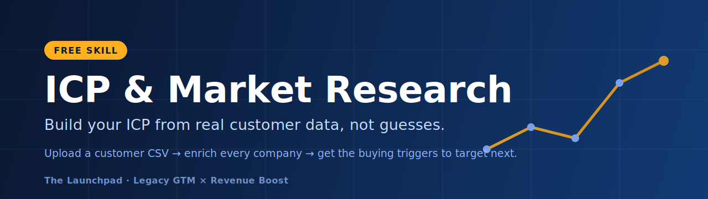

# ICP & Market Research Skill


Build your Ideal Customer Profile from real data, not guesses. Give it a list of
your won customers and it researches every company, finds the firmographics and
buying triggers they share, and hands you back the exact signals to target next.

A free skill from **The Launchpad** (Legacy GTM x Revenue Boost).

---

## What it does

- **Builds your ICP** across four layers: firmographics, technographics, buying
  signals, and psychographics, plus a one-paragraph ICP and anti-ICP.
- **Mines your customer list.** Upload a CSV of won customers and it enriches each
  company, tags the buying triggers (hiring, funding, new exec, expansion,
  product launch, and more), and ranks them by how many customers share each one.
  If 9 of 12 customers are hiring fast, headcount growth becomes a targeting rule.
- **Maps signals to your offer.** The same data point that scores a lead also
  writes the personalized opener. One enrichment, two jobs.
- **Gives you a report and the artifacts:** the ICP doc, an enriched customer
  table, and a plug-in block of filters ready to build your next list.

---

## What you need

- [Claude Code](https://claude.com/claude-code) installed. It includes Node, so
  there is nothing else to install. This skill uses no API keys and costs you
  nothing to run beyond your normal Claude usage.

---

## Install

In Claude Code, add this folder as a marketplace and install the plugin:

```
/plugin marketplace add ./icp-market-research
/plugin install market-research@market-research-marketplace
```

If you cloned or downloaded it elsewhere, point the first command at wherever the
`icp-market-research` folder lives.

**Or just drop it in:** copy `market-research/skills/market-research/` into your
project's `.claude/skills/` folder and reload Claude Code.

---

## How to use it

**Try it in 30 seconds.** An example customer list ships in
`market-research/examples/sample-customers.csv`. Say:

> "Here's my customer list — sample-customers.csv. Run the customer list import
> and show me the patterns."

**On your own data.** Export your won customers to a CSV with these columns
(header names can vary, it maps them for you):

| Column | What it is |
| --- | --- |
| Company | Company name |
| Domain | Their website |
| Job Title | The contact's title |
| Company LinkedIn | Company LinkedIn URL |
| Company News | A recent signal, if you know one (leave blank and it researches) |

Then upload it and say "build my ICP from this list." It will ask you three
things first (what you sell, your price, who you think your ICP is), then research
every company and hand back the patterns.

You can also skip the CSV and just say "build my ICP" to run the guided version.

---

## What comes back

1. **Your ICP** and the research behind it.
2. **Your offer** and the market around it (red ocean or blue ocean).
3. **Your customers** — the ranked trigger table and the exact signals to add to
   your targeting and list-building.

Plus an enriched customer CSV and a ready-to-use block of ICP filters.

---

## Want the whole system?

This is the Prospect step of the SCOPE method. The full **Launchpad** builds the
rest with you: the money model, deliverability, offer, campaigns, copy, lead
lists, and launch. If you want us to build your ICP from your real customer list
and get you 10 to 30+ meetings a month, [book a call](https://calendly.com/d/ds6g-y9t-phf/launchpad-strategy-session).

---

## License

Free to install, use, and share unmodified. Not for resale. See [LICENSE](LICENSE).
